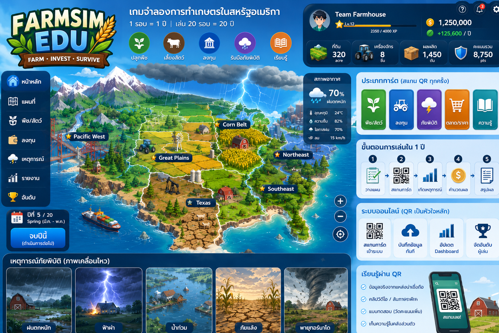
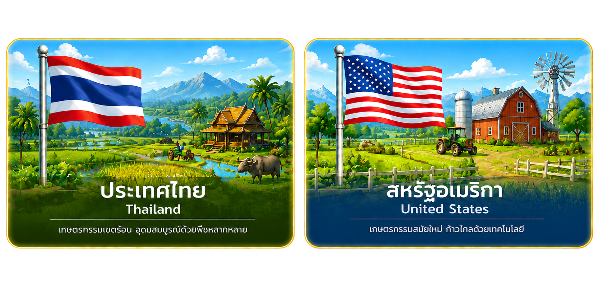

# คู่มือวิธีการเล่น FarmSim EDU

<p align="center">
  
</p>

เกมจำลองการเกษตรออนไลน์สำหรับนักเรียน ม.3 — เรียนรู้การวางแผน ตัดสินใจ และบริหารทรัพยากรฟาร์มตามภูมิภาคจริง

---

## สารบัญ

1. [ภาพรวมเกม](#1-ภาพรวมเกม)
2. [บทบาทในเกม](#2-บทบาทในเกม)
3. [เริ่มเกม — ผู้ดำเนินเกม](#3-เริ่มเกม--ผู้ดำเนินเกม)
4. [เริ่มเกม — ผู้เล่น](#4-เริ่มเกม--ผู้เล่น)
5. [ขั้นตอนการเล่นทั้งเกม](#5-ขั้นตอนการเล่นทั้งเกม)
6. [การ์ดตัดสินใจ 8 ประเภท](#6-การ์ดตัดสินใจ-8-ประเภท)
7. [การวางแผนการ์ดรายเดือน](#7-การวางแผนการ์ดรายเดือน)
8. [การปลูกพืชและฤดูกาล](#8-การปลูกพืชและฤดูกาล)
9. [ทรัพยากรและสถานะฟาร์ม](#9-ทรัพยากรและสถานะฟาร์ม)
10. [Breaking News — เหตุการณ์พิเศษ](#10-breaking-news--เหตุการณ์พิเศษ)
11. [โบนัสทายปัญหา](#11-โบนัสทายปัญหา)
12. [ตลาดกลางและการขายผลผลิต](#12-ตลาดกลางและการขายผลผลิต)
13. [คะแนนและอันดับ](#13-คะแนนและอันดับ)
14. [ระยะเวลาและจังหวะเกม](#14-ระยะเวลาและจังหวะเกม)
15. [หน้าจอ Dashboard (จอใหญ่)](#15-หน้าจอ-dashboard-จอใหญ่)
16. [หน้าจอมือถือผู้เล่น](#16-หน้าจอมือถือผู้เล่น)
17. [เคล็ดลับสำหรับครู/ผู้ดำเนินเกม](#17-เคล็ดลับสำหรับครูผู้ดำเนินเกม)
18. [เคล็ดลับสำหรับผู้เล่น](#18-เคล็ดลับสำหรับผู้เล่น)

---

## 1. ภาพรวมเกม

FarmSim EDU เป็นเกมจำลองการเกษตรแบบออนไลน์ 100% โดย:

- **จอใหญ่ (Dashboard)** ใช้แสดงผลกลาง — แผนที่ แอนิเมชัน อันดับ เหตุการณ์
- **มือถือ (Mobile Web)** ใช้ควบคุมเกม — วางแผน ตอบเหตุการณ์ ทายปัญหา

ผู้เล่น **1 คน = 1 ฟาร์ม** เล่นพร้อมกันได้สูงสุด **8 คน** ต่อห้อง  
ห้องหนึ่งเลือกได้ **1 ประเทศ** (ไทย หรือ สหรัฐอเมริกา) แล้วผู้เล่นเลือก **ภูมิภาค** ภายในประเทศนั้น

**ไม่ต้องสมัครสมาชิก** — เข้าเกมด้วย **รหัสห้อง + Game PIN + ชื่อ**

<p align="center">
  
</p>

---

## 2. บทบาทในเกม

| บทบาท | อุปกรณ์ | หน้าที่ |
|--------|---------|--------|
| **ผู้ดำเนินเกม / ครู** | คอมพิวเตอร์ + จอใหญ่ | สร้างห้อง เปิด Dashboard ให้นักเรียนสแกน QR เข้าเกม ดูความคืบหน้าและอันดับ |
| **ผู้เล่น / นักเรียน** | มือถือ | เข้าร่วมเกม เลือกภูมิภาค วางแผนการ์ด ตอบเหตุการณ์ ทายปัญหา |

> Dashboard **ไม่ใช่ตัวเล่นเกม** — ใช้แสดงผลเท่านั้น การตัดสินใจทั้งหมดทำบนมือถือ

---

## 3. เริ่มเกม — ผู้ดำเนินเกม

### ขั้นตอน

1. เปิดเว็บ FarmSim EDU → กด **「สร้างห้องเกม」**
2. **เลือกประเทศ** (ประเทศไทย หรือ สหรัฐอเมริกา)
3. ระบบเปิด **Dashboard Lobby** แสดง:
   - **รหัสห้อง** (6 ตัวอักษร)
   - **Game PIN** (6 หลัก)
   - **QR Code** สำหรับสแกนเข้าเกม
4. ให้นักเรียนสแกน QR หรือกรอกรหัสห้อง + PIN บนมือถือ
5. รอผู้เล่นเข้า (สูงสุด 8 คน) — กด **「เริ่มเกม」** บน Dashboard เมื่อพร้อม
6. เมื่อเกมเริ่ม เปิด **Dashboard เกม** เพื่อแสดงแผนที่ แอนิเมชัน และอันดับ

<p align="center">
  
  <br/>
  <em>ตัวอย่างหน้าจอ Dashboard — แผนที่ แถบ 12 เดือน อันดับผู้เล่น</em>
</p>

### ปุ่มที่ใช้ได้บน Dashboard Lobby

- **เริ่มเกม** — แอดมินกดเองเมื่อพร้อม (ต้องมีผู้เล่นอย่างน้อย 1 คน)
- **ยกเลิกห้อง** — ยกเลิกเกมก่อนเริ่ม

---

## 4. เริ่มเกม — ผู้เล่น

### ขั้นตอน

1. เปิดเว็บบนมือถือ → กด **「เข้าร่วมเกม」**
2. กรอก **รหัสห้อง** + **Game PIN** + **ชื่อผู้เล่น**
3. **ถ่ายรูปโปรไฟล์** (ไม่บังคับ) หรือข้าม
4. **เลือกภูมิภาค** — แต่ละคนเลือกได้ 1 ภูมิภาค (เลือกซ้ำกับผู้อื่นได้)
5. รอใน Lobby จนเกมเริ่ม

<p align="center">
  
  <br/>
  <em>ผู้ดำเนินเกมเลือกประเทศตอนสร้างห้อง · ผู้เล่นเลือกภูมิภาคภายในประเทศนั้น</em>
</p>

### ภูมิภาคประเทศไทย

| ภูมิภาค | ลักษณะ | พืชที่เหมาะ (ตัวอย่าง) |
|---------|--------|------------------------|
| เหนือ | อากาศเย็น ฤดูแล้งยาว | ข้าว ข้าวโพด ผักหัว สตรอว์เบอร์รี่ ชา ลำไย |
| กลาง | ลุ่มน้ำ ชลประทานดี | ข้าว อ้อย ทุเรียน มังคุด กุ้ง/ปลา |
| ใต้ | ฝนชุก ชื้นสูง | ยางพารา ปาล์มน้ำมัน ทุเรียน สับปะรด กาแฟ |
| อีสาน | แล้ง ดินทราย | ข้าว มัน อ้อย ถั่วเหลือง ผัก |

### ภูมิภาคสหรัฐอเมริกา

| ภูมิภาค | ลักษณะ | พืชที่เหมาะ (ตัวอย่าง) |
|---------|--------|------------------------|
| Midwest | Corn Belt ฤดูหนาวหนาว | Corn, Soybean, Wheat, Oats |
| South | อุ่นชื้น | Cotton, Rice, Peanuts, Citrus |
| West | แห้งแล้ง ชลประทาน | Almonds, Grapes, Lettuce, Avocado |
| Great Plains | ทุ่งหญ้า แล้ง | Wheat, Sorghum, Sunflower, Hay |

---

## 5. ขั้นตอนการเล่นทั้งเกม

<p align="center">
  
</p>

```
สร้างห้อง → Lobby (รอแอดมินกดเริ่ม)
    ↓
วางแผนการ์ด (Planning) — วางการ์ดครบ 12 เดือน (ใช้ซ้ำได้)
    ↓
ยืนยันแผน (ทุกคนยืนยันครบ → เริ่มจำลองอัตโนมัติ)
    ↓
จำลอง 12 เดือน (Simulation) — ทีละเดือน
    ├─ Breaking News (ถ้ามีเหตุการณ์)
    ├─ โบนัสทายปัญหา (เดือน 3, 6, 9, 12)
    └─ นับถอยหลังเดือน → คำนวณผล
    ↓
จบปี → คำนวณคะแนน → จบเกม (หรือวางแผนปีใหม่ ถ้าเล่นหลายปี)
    ↓
สรุปอันดับ + บทเรียน
```

### สถานะห้องเกม

| สถานะ | ความหมาย |
|--------|----------|
| `lobby` | รอผู้เล่นเข้า — เริ่มเมื่อแอดมินกด「เริ่มเกม」 |
| `planning` | วางแผนการ์ด |
| `simulating` | กำลังจำลองเดือน |
| `finished` | เกมจบ |

---

## 6. การ์ดตัดสินใจ 8 ประเภท

ผู้เล่นเลือกจาก **8 ประเภทการ์ด** วางลงใน **12 เดือน** (เดือนละ 1 การ์ด)  
**ใช้การ์ดซ้ำประเภทเดียวกันได้** ตามต้องการ — ระบบไม่ล็อกประเภท  
ถ้าวางซ้ำชนิดเดียวทั้งปี ระบบยอมให้ยืนยันได้ แต่ผลผลิต/คะแนนจะต่ำมาก (อาจติดลบ)

<p align="center">
  
  
  
  
  
  
  
  
</p>

| การ์ด | ชื่อไทย | ผลเมื่อถึงเดือนนั้น |
|-------|---------|---------------------|
| **PLANT** | ปลูกพืช | -10 เหรียญ, -5 น้ำ, เริ่มปลูกพืชที่วางแผนไว้ |
| **WATER** | จัดการน้ำ | -30 เหรียญ, +25 น้ำ |
| **FERTILIZE** | ใส่ปุ๋ย | -40 เหรียญ, -5 ความยั่งยืน |
| **PROTECT** | ป้องกันศัตรู | -25 เหรียญ |
| **HARVEST** | เก็บเกี่ยว | เก็บผลผลิตเข้าคลัง (ตามพืชที่ปลูก) |
| **TECH** | ลงทุนเทคโนโลยี | -80 เหรียญ, +1 ระดับเทคโนโลยี (สูงสุด 5) |
| **SOIL** | ปรับปรุงดิน | -35 เหรียญ, +15 คุณภาพดิน, +5 ความยั่งยืน |
| **TRADE** | ขายผลผลิต | ขายผลผลิตในคลังทั้งหมดที่ตลาดกลาง |

### เดือนที่ไม่มีการ์ด

- ระบบบังคับให้วางครบ **ทั้ง 12 เดือน** ก่อนยืนยันแผน (ไม่มี Auto Run)

---

## 7. การวางแผนการ์ดรายเดือน

### กฎหลัก

1. เลือกการ์ดจาก **มือ 8 ประเภท** แล้วแตะ **เดือน** ที่ต้องการใช้
2. **ใช้การ์ดซ้ำประเภทได้** — ไม่บังคับครบทุกประเภท
3. ต้องวางครบ **12 เดือน** ก่อนกด **「ยืนยันแผน」**
4. หลังยืนยันแล้ว **แก้ไขไม่ได้** (ยกเว้นช่วงภัยพิบัติ — ดูข้อ 10)
5. การ์ด **ปลูกพืช** ต้อง **พิมพ์ชื่อพืช** (เช่น ข้าว, ข้าวโพด, ทุเรียน)
6. เมื่อผู้เล่น **ทุกคนยืนยันครบ** ระบบเริ่มจำลองอัตโนมัติ
7. ถ้าวางแผนแย่ (ซ้ำชนิดเดียว / ไม่ปลูก) ระบบยังยอม แต่จะเตือนและลดคะแนน

<p align="center">
  
</p>

### ตัวอย่างการวางแผน

ผู้เล่นออกแบบแผนเองทั้ง 12 เดือน — ระบบไม่แนะนำลำดับการ์ดหรือเดือนปลูก

---

## 8. การปลูกพืชและฤดูกาล

### การเลือกพืชตอนวางแผน

- ผู้เล่นต้อง **พิมพ์ชื่อพืชที่มีในระบบ** เท่านั้น (ตรงกับชื่อไทย/อังกฤษในฐานข้อมูล)
- ถ้าพิมพ์ผิด ระบบแสดง **ตัวเลือกสุ่ม 3 ชนิด** ให้ลองเลือก — ไม่แนะนำตามความใกล้เคียง
- **ไม่มีคู่มือฤดูปลูก / คำแนะนำเดือนปลูก / ภูมิภาค / การวางการ์ด** ในหน้าวางแผน
- ผู้เล่นต้องไปศึกษาค้นคว้าเองก่อนเล่น

ผลของภูมิภาคและฤดูกาลคำนวณในเกมหลังจำลอง — ไม่แจ้งล่วงหน้าตอนวางแผน

### ฤดูกาลประเทศไทย (อ้างอิงสำหรับครู)

| ฤดู | เดือน |
|-----|-------|
| ฤดูฝน | พ.ค. – ต.ค. |
| ฤดูหนาว | พ.ย. – ก.พ. |
| ฤดูร้อน | มี.ค. – เม.ย. |

### การเก็บเกี่ยว

- ใช้การ์ด **เก็บเกี่ยว** ในเดือนที่พืชโตครบตาม `growth_months`
- สูตรผลผลิตโดยประมาณ: `(50 + ดิน/5) × ความสามารถ% × ตัวคูณภูมิภาค × ตัวคูณฤดู`

<p align="center">
  
  <br/>
  <em>เลือกพืชให้เหมาะกับภูมิภาคและฤดูกาล — ผู้เล่นต้องค้นคว้าเองก่อนวางแผน</em>
</p>

---

## 9. ทรัพยากรและสถานะฟาร์ม

### ทรัพยากรหลัก (แสดงบนมือถือ)

<p align="center">
  
  
  
  
  
</p>

| ทรัพยากร | สัญลักษณ์ | ความหมาย |
|----------|----------|----------|
| เหรียญลงทุน | 💰 | ใช้จ่ายกิจกรรมต่าง ๆ |
| น้ำ | 💧 | จำเป็นสำหรับการเกษตร (0–100) |
| ความสามารถด้านการเกษตร | 🌱 | ส่งผลต่อผลผลิตและคะแนน (0–100%) |

### ทรัพยากรอื่น (ใช้คำนวณคะแนน)

- **คุณภาพดิน** (soil_quality) — ส่งผลผลผลิต
- **ระดับเทคโนโลยี** (tech_level) — 0–5, เพิ่มจากการ์ดลงทุนเทคโนโลยี
- **ผลผลิตในคลัง** (stock_amount) — จากเก็บเกี่ยว, ขายด้วยการ์ด TRADE
- **ความยั่งยืน** (sustainability) — ได้จากปรับปรุงดิน, ลดจากใส่ปุ๋ย

### ค่าเริ่มต้นตามภูมิภาค (ประเทศไทย)

| ภูมิภาค | เหรียญ | น้ำ | ดิน |
|---------|-------|-----|-----|
| เหนือ | 480 | 75 | 75 |
| กลาง | 520 | 90 | 80 |
| ใต้ | 500 | 85 | 70 |
| อีสาน | 450 | 60 | 65 |

---

## 10. Breaking News — เหตุการณ์พิเศษ

### เมื่อไหร่เกิด

- สุ่ม **2–3 เหตุการณ์ต่อปี** ในเดือน 2–11
- แสดง **Breaking News** บน Dashboard และมือถือ **15 วินาที** ก่อนเริ่มนับเดือน

### ประเภทเหตุการณ์

<p align="center">
  
  
  
</p>

| ประเภท | ตัวอย่าง (ไทย) | วิธีรับมือบนมือถือ |
|--------|----------------|-------------------|
| **ภัยพิบัติ** (`disaster`) | น้ำท่วม, ภัยแล้ง, โรคระบาดพืช | ป้องกัน / ย้ายการ์ด / ปรับแผนใหม่ / ไม่ทำอะไร |
| **นโยบายรัฐ** (`government_policy`) | นโยบายรัฐสนับสนุน, โครงการชลประทาน | ใช้โอกาสจากนโยบายรัฐ / ไม่ทำอะไร |

### การตอบสนองภัยพิบัติ

| ตัวเลือก | รายละเอียด |
|----------|------------|
| **ต้องการปรับแผนกิจกรรมใหม่** | เข้าโหมดแก้การ์ด — แก้ได้ตั้งแต่เดือนปัจจุบันเป็นต้นไป (สูงสุด **2 ครั้ง** ต่อผู้เล่น) |
| **ใช้การ์ดป้องกัน / เตรียมพร้อม** | ตอบสนองเหตุการณ์ (ลดความเสียหาย) |
| **ย้ายการ์ด** | ย้ายการ์ดจากเดือนหนึ่งไปอีกเดือน — เสีย **-15 เหรียญ, -20 น้ำ** |
| **ไม่ทำอะไร** | เสี่ยงลดความสามารถด้านการเกษตร |

### การตอบสนองนโยบายรัฐ

| ตัวเลือก | ผล |
|----------|-----|
| **ใช้โอกาสจากนโยบายรัฐ** | +5 ความสามารถ, +30 เหรียญ |
| **ไม่ทำอะไร** | ไม่ได้รับโบนัส |

> ถ้าไม่ตอบก่อนหมดเวลา Breaking News ระบบจะลงโทษอัตโนมัติ

---

## 11. โบนัสทายปัญหา

<p align="center">
  
</p>

### เมื่อไหร่เกิด

- เปิดในเดือน **3, 6, 9, 12** (มี.ค., มิ.ย., ก.ย., ธ.ค.)
- คำถามแบบ **เลือกตอบ A/B** จากแบบสอบถามความรู้พลเมือง (ประมาณ 50 ข้อ)

### วิธีเล่น

1. อ่านคำถามบนมือถือ
2. เลือก **ก** หรือ **ข** → กดส่ง
3. รอผู้เล่นคนอื่นตอบ หรือหมดเวลา

### คะแนนเหรียญ

| ผล | เหรียญ |
|----|--------|
| ตอบถูก **คนแรก** | **+10** |
| ตอบถูกคนถัดไป | **+2** |
| ตอบผิด | **-10** |

### ระยะเวลา

- มีเวลา **25 วินาที** ต่อรอบตอบ (ถ้าไม่มีใครตอบภายใน 8 วินาที ระบบนับถอยหลัง 5 วินาทีแล้วปิดอัตโนมัติ)
- ปิดอัตโนมัติเมื่อทุกคนตอบครบ **หรือ** หมดเวลา
- จากนั้นแสดง **ผู้ตอบถูก + เสียงปรบมือ** บน Dashboard **6 วินาที** (นาฬิกาเดือนหยุดรอ)
- แล้วเกมเดินต่อเดือนถัดไป

---

## 12. ตลาดกลางและการขายผลผลิต

- ห้องเกมมี **ตลาดกลางเดียว** — ราคาขึ้นลงตามอุปสงค์-อุปทาน
- ใช้การ์ด **ขายผลผลิต (TRADE)** ในเดือนที่ต้องการขาย
- ขาย **ผลผลิตในคลังทั้งหมด** ณ ราคาตลาดปัจจุบัน
- ได้เหรียญ + เพิ่มความสามารถด้านการเกษตรเล็กน้อย
- Dashboard แสดงราคาตลาดกลางระหว่างเล่น

---

## 13. คะแนนและอันดับ

### มิติที่ใช้คำนวณคะแนน

| มิติ | มาจาก |
|------|-------|
| การผลิต (Production) | ผลผลิตในคลัง |
| ทรัพยากร (Resource) | เหรียญคงเหลือ |
| เทคโนโลยี (Technology) | ระดับเทคโนโลยี |
| ความยั่งยืน (Sustainability) | ค่าความยั่งยืน |
| ความเสี่ยง (Risk) | ความสามารถด้านการเกษตร (ยิ่งต่ำยิ่งเสี่ยง) |
| สิ่งแวดล้อม (Environment) | ผลกระทบสิ่งแวดล้อม |
| ความสามารถ (Capability) | ความสามารถด้านการเกษตร |

### อันดับ

- แสดง **อันดับรายปี** ระหว่างเล่นบน Dashboard และมือถือ
- **อันดับสุดท้าย** เมื่อจบเกม พร้อม **บทเรียนจากเกม** (สรุปปัญหาและผลการดำเนินการ)

---

## 14. ระยะเวลาและจังหวะเกม

<p align="center">
  
</p>

<p align="center">
  
</p>

ค่าต่อไปนี้เป็นค่าที่ระบบใช้จริงในปัจจุบัน:

| รายการ | เวลา |
|--------|------|
| รอใน Lobby | **จนกว่าแอดมินกดเริ่ม** (ไม่นับถอยหลังอัตโนมัติ) |
| ขยาย Lobby | — (ยกเลิกแล้ว) |
| นับถอยหลังเริ่มเกม | — (ยกเลิกแล้ว กดเริ่มเอง) |
| จำนวนปีต่อเกม | **1 ปี** (12 เดือน) |
| เวลาต่อเดือน (จำลอง) | **10 วินาที** |
| Breaking News | **15 วินาที** |
| โบนัสทายปัญหา (ตอบ) | **25 วินาที** (ไม่มีใครตอบ → รอ 8 วิ แล้วนับถอยหลัง 5 วิ ปิดอัตโนมัติ) |
| โบนัสทายปัญหา (ประกาศผู้ถูก) | **6 วินาที** |
| ผู้เล่นสูงสุด | **8 คน** |

### ลำดับในแต่ละเดือน

```
1. Breaking News (ถ้ามีเหตุการณ์) — 15 วินาที
2. โบนัสทายปัญหา (เดือน 3,6,9,12) — ตอบ 25 วินาที → ประกาศผู้ถูก 6 วินาที
3. นับถอยหลังเดือน — 10 วินาที
4. คำนวณผลการ์ด → เดือนถัดไป
```

---

## 15. หน้าจอ Dashboard (จอใหญ่)

### Lobby (`/dashboard/lobby/:roomCode`)

- QR Code + Game PIN
- รายชื่อผู้เล่นที่เข้าแล้ว
- ปุ่ม **เริ่มเกม** / ยกเลิกห้อง

### เกม (`/dashboard/game/:roomCode`)

| องค์ประกอบ | รายละเอียด |
|------------|------------|
| **แถบ 12 เดือน** | แสดงความคืบหน้าทั้งปี — เดือนที่ผ่านแล้ว / เดือนปัจจุบัน / เดือนที่มีคนวางการ์ด |
| **แผนที่ประเทศไทย** | แสดงตำแหน่งผู้เล่นตามภูมิภาค + การ์ดที่เล่นเดือนนี้ (เฉพาะประเทศไทย) |
| **Breaking News** | แจ้งเตือนเหตุการณ์พิเศษเต็มจอ |
| **โบนัสทายปัญหา** | แสดงคำถาม + จำนวนคนตอบ + นับถอยหลัง + ประกาศผู้ตอบถูก (5 วินาที) |
| **อันดับ** | คะแนนและอันดับผู้เล่น |
| **ตลาดกลาง** | ราคาพืชผล |
| **เสียง** | เพลงพื้นหลัง + เอฟเฟกต์สภาพอากาศ (แตะหน้าจอครั้งแรกเพื่อเปิดเสียง ถ้าเบราว์เซอร์บล็อก) |

---

## 16. หน้าจอมือถือผู้เล่น

<p align="center">
  
  <br/>
  <em>ผู้เล่นควบคุมเกมทั้งหมดบนมือถือ — ระบบเปลี่ยนหน้าอัตโนมัติตามสถานะห้อง</em>
</p>

| หน้า | ทำอะไร |
|------|--------|
| **เข้าร่วมเกม** | กรอกรหัสห้อง + PIN + ชื่อ |
| **โปรไฟล์** | ถ่าย/เลือกรูป หรือข้าม |
| **เลือกภูมิภาค** | เลือกภูมิภาค (ซ้ำกับผู้อื่นได้) |
| **รอใน Lobby** | ดูจำนวนผู้เล่น + เวลาเหลือ |
| **วางแผนการ์ด** | เลือกการ์ด → แตะเดือนครบ 12 → ยืนยัน (ใช้ซ้ำได้) |
| **ระหว่างจำลอง** | ดูทรัพยากร, ตอบ Breaking News, ทายปัญหา, ปรับแผน (ภัยพิบัติ) |
| **จบเกม** | อันดับของตน + วิเคราะห์แผนละเอียด (ข้อดี / ข้อผิด / คำแนะนำ) |

> ระบบเปลี่ยนหน้าอัตโนมัติตามสถานะห้อง — ไม่ต้องกดเปลี่ยนหน้าเอง

---

## 17. เคล็ดลับสำหรับครู/ผู้ดำเนินเกม

1. **เตรียมจอใหญ่ล่วงหน้า** — เปิด Dashboard Lobby ก่อนให้นักเรียนเข้า
2. **แจก QR Code** — นักเรียนสแกนเข้าได้เร็ว ไม่ต้องพิมพ์รหัสยาว
3. **กด「เริ่มเกม」** เมื่อนักเรียนเข้าพร้อมแล้ว (ไม่มีการนับถอยหลังอัตโนมัติ)
4. **เปิดเสียง Dashboard** — แตะหน้าจอครั้งแรกเพื่อให้เพลงและเอฟเฟกต์เล่น
5. **อธิบายกฎก่อนเริ่ม** — วางครบ 12 เดือน (ซ้ำประเภทได้), พิมพ์ชื่อพืช, Breaking News, และโบนัส A/B
6. **เตือนแผนแย่** — ถ้านักเรียนวางการ์ดชนิดเดียวทั้งปี จะได้คะแนนต่ำ
7. **ใช้แถบ 12 เดือน** อธิบายว่าเกมนับถอยหลังจนจบปี
8. **หลังจบเกม** ใช้ **บทเรียนจากเกม** สรุปกับนักเรียน

---

## 18. เคล็ดลับสำหรับผู้เล่น

1. **ค้นคว้าก่อนเล่น** — ศึกษาพืช ฤดู ภูมิภาค และการวางแผนการ์ดจากแหล่งภายนอก (ในเกมไม่มีคู่มือแนะนำ)
2. **ตอบ Breaking News ทันที** เมื่อเกิดเหตุการณ์
3. **ตอบโบนัสทายปัญหาเร็ว** — คนแรกได้ +10 เหรียญ (เลือก ก/ข)
4. **ใช้สิทธิ์ปรับแผน** (2 ครั้ง) เฉพาะเมื่อจำเป็นจริง ๆ ช่วงภัยพิบัติ
5. **ดูอันดับ** ระหว่างเล่นเพื่อปรับกลยุทธ์

---

## ภาคผนวก — URL ที่ใช้

| หน้า | URL |
|------|-----|
| หน้าแรก | `/` |
| สร้างห้อง | `/create` |
| เข้าร่วมเกม | `/join` หรือ `/join/:roomCode` |
| Dashboard Lobby | `/dashboard/lobby/:roomCode` |
| Dashboard เกม | `/dashboard/game/:roomCode` |

**Production:** https://farm-sim-mu.vercel.app

---

*เอกสารนี้จัดทำจากระบบ FarmSim EDU เวอร์ชันปัจจุบัน — ค่าเวลาและกฎอ้างอิงจาก `backend/config/app.php` และ `frontend/src/constants/simulation.js`*
